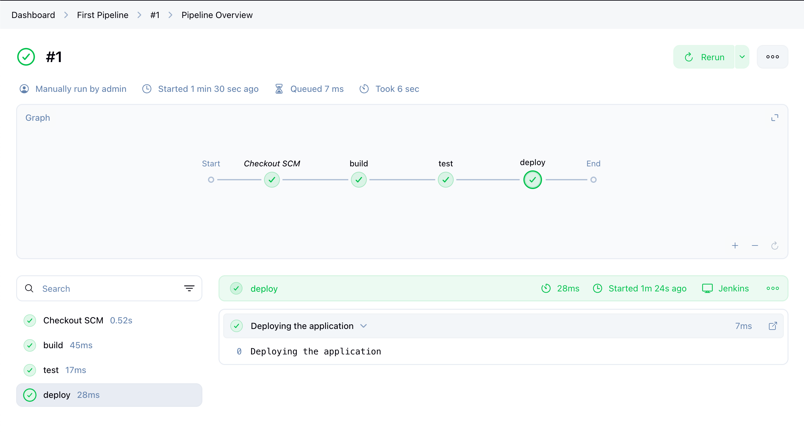
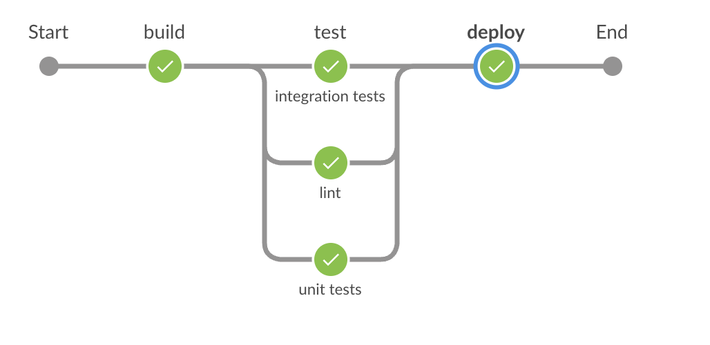

### Jenkin Infrastrucuture
1. Master server: 
- Control the pieplines 
- Schedules builds

2. Agents/Minion: 
- Perform the Build

### Agent types: 
1. Pernament Agents: 
- Standalone server, that is dedicated for running jobs

2. Cloud Agents: 
- Docker/Kubernetes/AWS Fleet Manager

### Two main build jobs: 
1. Freestyle Build project
- Simplest method to create a build
- Feels like Shell Scripting running on a server

2. Pipeline: 
- Use the Groovy Syntax
- Use Stages to breakdown 

### There are two types of jenkinsfile: 
1. Groovy
2. Just regular script

### Required fields for Jenkinsfile: 
```
pipeline {
    agent any - Where to execute? 

    stages {    - All of the stages that will run
        stage("build){

            steps { - All of the command
                echo 'building the application'
            }
        }

        stage("test){

            steps {
                echo 'Testing the application'
            }
        }

        stage("deploy){

            steps {
                echo 'Deploying the application'
            }
        }
    }
}

```

### The visualization: 
1. Single pipeline flow


This graph show the stages. Each stage will be a circle in here. 

2. Parallel Stages: 


This graph show parallel stages. We can find the file correspond to this in `/Jenkinsfile.parallel`

### Post Stage: 
This is the actions that will run after the stages finish. For example, the Post stage can allow you to send notification to the different systems so the team will know. 

### When expressions: 